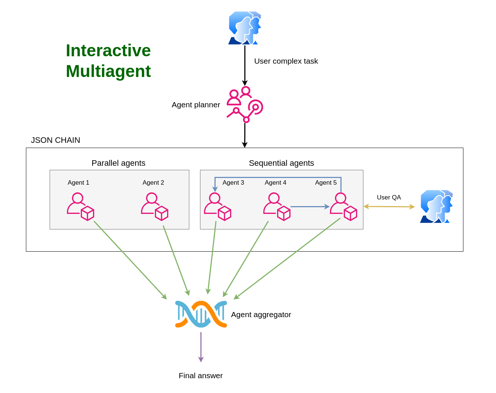

# Interactive Multiagent

**Interactive Multiagent** is an intelligent system designed to orchestrate and manage a chain of autonomous agents within complex systems. 
By decomposing intricate tasks into simpler, manageable sub-tasks, Interactive Multiagent ensures efficient and effective task execution through specialized agents.

## Features

### Task Decomposition and Management
Interactive Multiagent takes a complex task and breaks it down into smaller, more manageable sub-tasks. Each sub-task is handled by an autonomous agent, ensuring that every aspect of the original task is addressed comprehensively.

### Agent Planner
At the core of Interactive Multiagent is the **Agent Planner**, which handles the initial request by creating a JSON chain. This JSON chain delineates the function of each sub-agent and the connections between them, establishing a clear workflow for task execution.

### Autonomous and Dependent Agents
Each sub-agent within the chain can operate independently or depend on other agents. Dependencies indicate that an agent's input is structured based on the output from one or more preceding agents in the JSON chain, ensuring a coherent and logical progression of tasks.

### Interactive Mode
In interactive mode, agents may require additional information from the user to complete their specific tasks. When such information is needed, the script pauses and awaits the user's response in the chat. This ensures that all necessary data is collected before proceeding.

### Sequential or Parallel Execution
To optimize performance and reduce response latency, the Agent Planner can execute the JSON chain in a sequential or parallel manner. In sequential mode, the chain is executed step-by-step, with each agent waiting for the previous one to complete before proceeding. In parallel mode, all agents are executed concurrently, allowing for simultaneous processing of different tasks.
The system decides whether to execute agents in parallel or sequentially based on their characteristics. If an agent requires waiting for input from the user or other agents, it will execute sequentially; otherwise, if independent, it will execute in parallel.


### Final Aggregation
Once all required data is gathered, the outputs from all agents are passed to the final agent in the JSON chain, known as the **Aggregator**. This agent synthesizes the information to produce a comprehensive final output.




## Video Demo

Discover the capabilities of Interactive Multiagent with this [video demo](https://youtu.be/YK8eC451C20).


## Example JSON Chain

Below is an example of a JSON chain created by the initial Agent Planner using the following prompt:

*“I want to start an e-commerce business. Can you help me structure all aspects of the company, including operational, marketing, and growth strategies to break even within 1 year and achieve at least $1,000,000 in revenue within 2 years? I would also like a detailed plan with market analysis, expense forecasts, customer acquisition strategies, and cost optimization.”*

```json
{
  "agents": [
    {
      "agent_nickname": "MarketAnalysis",
      "agent_llm_prompt": "Conduct a comprehensive market analysis for a new e-commerce business aiming to break even within 1 year and achieve $1,000,000 revenue in 2 years. Include industry trends, target demographics, competitor analysis, and potential market size.",
      "input_from_agents": [],
      "user_questions": [
        "What specific products or services will your e-commerce business offer?",
        "Do you have a target geographic market?"
      ]
    },
    {
      "agent_nickname": "OperationalPlanning",
      "agent_llm_prompt": "Develop an operational plan for the e-commerce business, including supply chain management, inventory management, order fulfillment, customer service, and technology infrastructure.",
      "input_from_agents": ["MarketAnalysis"],
      "user_questions": [
        "What platforms or technologies are you considering for your e-commerce site?"
      ]
    },
    {
      "agent_nickname": "MarketingStrategy",
      "agent_llm_prompt": "Create a detailed marketing strategy for the e-commerce business, focusing on brand positioning, online marketing channels, content strategy, social media engagement, and advertising campaigns.",
      "input_from_agents": ["MarketAnalysis"],
      "user_questions": []
    },
    {
      "agent_nickname": "ExpenseForecasting",
      "agent_llm_prompt": "Prepare an expense forecast for the e-commerce business for the next two years, including startup costs, operational expenses, marketing budgets, staffing costs, and other relevant expenditures.",
      "input_from_agents": ["OperationalPlanning", "MarketingStrategy"],
      "user_questions": [
        "What is your initial budget for starting the business?"
      ]
    },
    {
      "agent_nickname": "CustomerAcquisition",
      "agent_llm_prompt": "Outline customer acquisition strategies for the e-commerce business, including customer acquisition cost (CAC) analysis, retention strategies, referral programs, and loyalty incentives.",
      "input_from_agents": ["MarketingStrategy"],
      "user_questions": []
    },
    {
      "agent_nickname": "CostOptimization",
      "agent_llm_prompt": "Identify opportunities for cost optimization within the e-commerce business operations, including bulk purchasing, automation tools, outsourcing, and process improvements.",
      "input_from_agents": ["ExpenseForecasting"],
      "user_questions": [
        "Do you prefer in-house operations or outsourcing certain functions?"
      ]
    },
    {
      "agent_nickname": "GrowthStrategy",
      "agent_llm_prompt": "Develop a growth strategy for the e-commerce business to scale operations, expand product lines, enter new markets, and increase revenue streams over the next two years.",
      "input_from_agents": ["OperationalPlanning", "CustomerAcquisition"],
      "user_questions": [
        "Are you considering international markets?"
      ]
    },
    {
      "agent_nickname": "Aggregator",
      "agent_llm_prompt": "Aggregate and synthesize the outputs from all agents to create a comprehensive plan for starting an e-commerce business, including market analysis, operational setup, marketing and customer acquisition strategies, expense forecasts, cost optimizations, and growth strategies aimed at breaking even within one year and achieving $1,000,000 in revenue within two years.",
      "input_from_agents": [
        "MarketAnalysis",
        "OperationalPlanning",
        "MarketingStrategy",
        "ExpenseForecasting",
        "CustomerAcquisition",
        "CostOptimization",
        "GrowthStrategy"
      ]
    }
  ]
}
```


# Interactive Multiagent Application Setup

Follow the steps below to set up and run the **Interactive Multiagent** application using Docker. This setup ensures that all necessary services are built and started correctly, with session management handled seamlessly via a Redis database.

## Prerequisites

- **Docker**: Ensure that Docker is installed on your system. You can download it from [here](https://www.docker.com/get-started).
- **Docker Compose**: Typically included with Docker Desktop installations. Verify by running `docker-compose --version`.

## Steps to Initialize the Application

 1. Clone the repository:

```bash
git clone https://github.com/mySanibot/interactive-multiagent.git
```

2. Navigate to the project directory:
```bash
cd interactive-multiagent
```

3. Build the Docker image:
```bash
docker-compose build
```

4. Run the Docker container:
```bash
docker-compose up -d
```

5. Check the backend logs:
```bash
docker logs -f flask_app
```

6. Access the application:
```bash
http://localhost:5000
```

- if you want to rebuild and restart the application:

```bash
docker-compose down
docker rmi interactivemultiagent-web
docker-compose build
docker-compose up -d
docker logs -f flask_app
```

- if you want to enter the app container's bash shell:
```bash
docker exec -it flask_app bash
```

- if you want to enter the redis container's bash shell and get session data:
```bash
docker exec -it redis sh
redis-cli
KEYS session:*
GET session:<sessionnumber>
```

Understanding the AgentPlanner Parameters
The AgentPlanner is a core component responsible for orchestrating the chain of agents based on user interactions and task requirements. Below is a breakdown of its parameters:

```python
planner = AgentPlanner(chat_history, is_interactive=True, session_id=session_id, user_id=user_id)
planner.run_planner()
```

- **session_chat_history**: A list of messages exchanged between the user and the agent. This is used to maintain context and track the conversation.
- **session_id**: A unique identifier for the session. This is used to identify and retrieve the session data from the Redis database. 
- **user_id**: A unique identifier for the user. This is used to identify and retrieve the user data from the Redis database.
- **is_interactive**: A boolean flag indicating whether the agent is in interactive mode. If True, the agent will pause and wait for user input when needed. 
- **start_system_prompt**: The system prompt to send to the LLM. This is the initial prompt that the agent will use to generate the JSON chain. It is set bby default but you can override it with the prompt you want to use.
